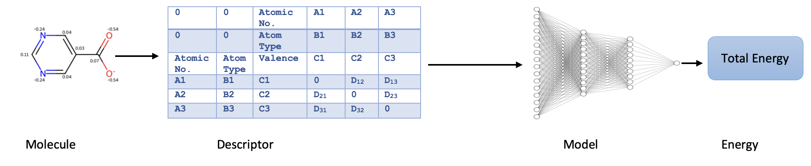

# Neural Network Potentials Using a Matrix-Based Descriptor

<!-- Add an image in the header -->



This reserach proposed an efficient ML potential for molecular energy prediction using  a matrix-based descriptor.

## Table of Contents

- [Requirements](#Requirements)
- [Installation](#installation)
- [Citation](#Citation)
- [License](#license)


## Requirements

The following packages are required to work and run the project files.

- [pytorch-1.1](#pytorch-1.1)
- [numpy](#numpy)
- [ase](#ase)
- [Pandas](#Pandas)
- [h5py](#h5py)


## Installation

Please use the following steps for running and installation of the project files.

```bash
# Example installation steps
$ cd Matrix_BasedModel
$ git clone https://github.com/OmidTarkhaneh/Retrievium_Descriptor.git
$ Run the Train_Test_Model.py
```

## Citation
To use this project please cite the following references:

## License

